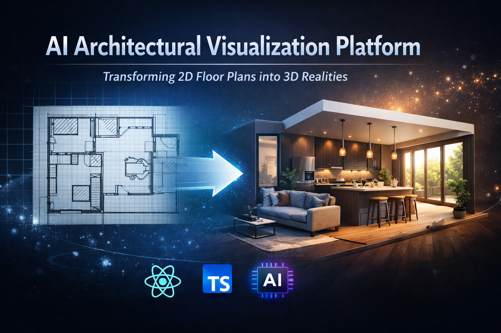

<p align="center">
  
</p>

# 🏗️ AI Architectural Visualization Platform

<p align="center">
  
</p>

<p align="center">
  
  
  
  
  
  
</p>

An **AI-powered architectural visualization SaaS** built with **React, TypeScript, and Puter**. The platform transforms **2D architectural floor plans into photorealistic 3D renders** using advanced AI models such as **Claude and Gemini**.

The application provides **permanent hosting for generated renders, persistent metadata storage, and a global community feed** where users can share their architectural designs.

This project demonstrates modern web architecture using **serverless infrastructure, high-performance storage systems, and AI-powered rendering pipelines**.

---

## 🌐 Live Demo

🔗 **Deployed Application**
[https://roomify-yuv.vercel.app/]

---

# ⚙️ Tech Stack

### React

React is a popular JavaScript library for building user interfaces, specifically for creating **single-page applications with a component-based architecture**.

### Vite

Vite is a next-generation frontend tool that provides an **extremely fast development environment and optimized build process** for modern web applications.

### TypeScript

TypeScript is a strongly typed superset of JavaScript that introduces **static typing**, helping developers catch errors early and maintain large codebases more effectively.

### TailwindCSS

TailwindCSS is a utility-first CSS framework that allows developers to build modern interfaces quickly using **predefined utility classes**.

### Puter

Puter is the underlying **cloud computing platform and Internet OS** that powers the infrastructure of the application. It provides **serverless Workers, permanent file storage, key-value databases, and hosted AI models**.

### Puter.js

Puter.js is the official JavaScript SDK used to **interact with Puter’s cloud services directly from the frontend**.

### CodeRabbit

CodeRabbit is an AI-powered code review platform that provides **automated suggestions and deep insights to improve code quality and security**.

### Junie (JetBrains)

Junie is an AI-powered coding assistant integrated into JetBrains IDEs that helps developers with **complex logic generation, refactoring, and prompt engineering**.

### Claude & Gemini

Claude and Gemini are advanced **large language models used to power the AI rendering pipeline**, enabling architectural sketch interpretation and photorealistic image generation.

---

# 🔋 Features

👉 **2D-to-3D Visualization**
Transforms flat architectural floor plans into **high-quality photorealistic 3D models using AI**.

👉 **Persistent Media Hosting**
Every uploaded image and generated render receives a **permanent public URL**, ensuring assets remain accessible.

👉 **Dynamic Project Gallery**
Users get a personal workspace that **tracks the history of their visualizations with instant loading and metadata persistence**.

👉 **Side-by-Side Comparison**
Compare the **original architectural sketch and the AI-generated render** in an interactive interface.

👉 **Global Community Feed**
Users can publish their projects to a **public feed where architectural ideas can be discovered and shared**.

👉 **Privacy Controls**
Granular visibility settings allow users to **toggle projects between private and public modes**.

👉 **Ownership Mapping**
A structured metadata system that **tracks project ownership, user IDs, and project details across the platform**.

👉 **Modern Export Tools**
Download AI-generated renders easily for **presentations, portfolios, and professional workflows**.

👉 **Scalable Architecture**
Serverless workers and high-performance storage enable the platform to **scale efficiently with increasing workloads**.

---

# 📸 Application Preview

<p align="center">
  
</p>

<p align="center">
  
</p>

<p align="center">
  
</p>

---

# ⚡ Quick Start

Clone the repository

```bash
git clone https://github.com/your-username/your-repository-name.git
```

Navigate into the project folder

```bash
cd your-repository-name
```

Install dependencies

```bash
npm install
```

Run the development server

```bash
npm run dev
```

The application will start at:

```
http://localhost:5173
```
